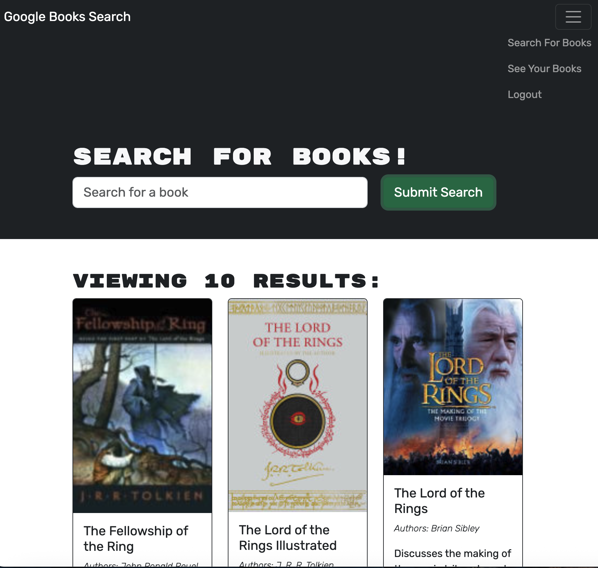

## Book-Search-Engine

## Description

The following demonstrates a book-search application using a GraphQL API and built with Apollo Server. The app was built using the MERN stack, with a React front end, MongoDB database, and Node.js/Express.js server and API. It's already set up to allow users to save book searches to the back end.

## Image

## URL Link

App Link: https://drive.google.com/file/d/1s2xgB3S_jR88rzcA0uyXND-wkLz1EGN6/view

## Contributing

Ongoing contributions can be made using the GitHub repository.

## Tests

Tests can be ran using Cypress and updates can be done on the GitHub repository.

## Questions

If you have any questions, please contact me at wmvrisso@gmail.com.
